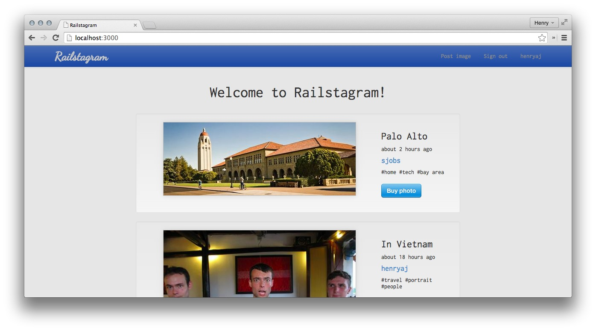
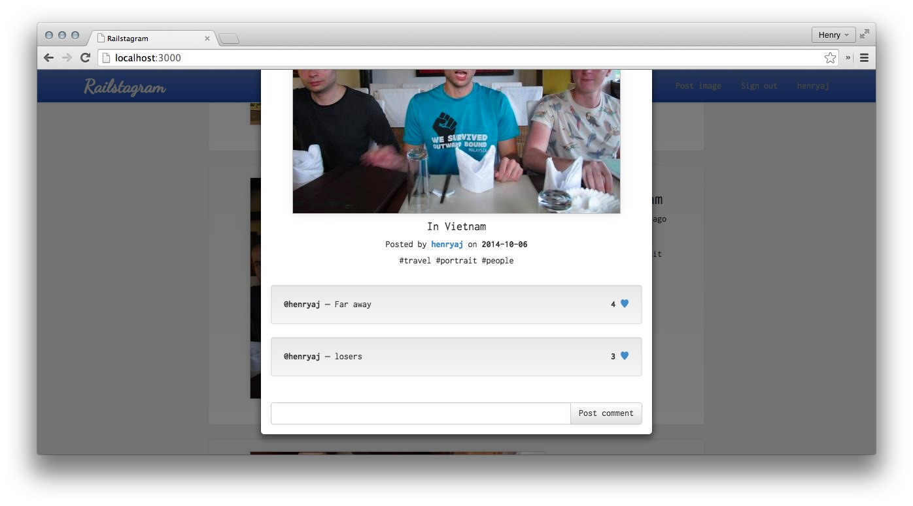

# Railstagram

Instagram clone in Rails.

Features live commenting using AJAX, a neat file picker that ties in with Facebook, Dropbox and other sources, user profile pages and modals.

## Technologies

* Bootstrap
* Ruby on Rails
* Postgres
* Devise and OAuth
* filepicker.io's lovely file picker modal
* RSpec, Capybara, Selenium, Factory Girl and [shoulda](https://github.com/thoughtbot/shoulda) for testing